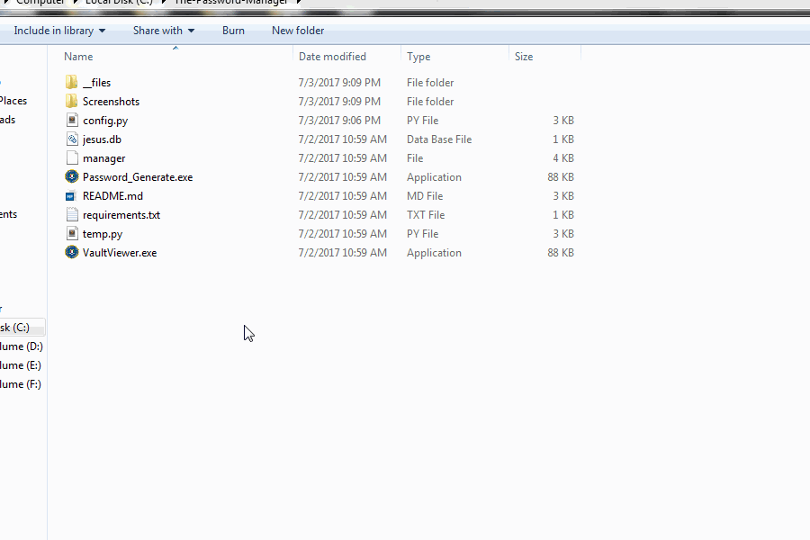

# The Password Manager
[](https://github.com/roothaxor/The-Password-Manager)
[](https://www.roothaxor.in)
[](https://github.com/roothaxor/The-Password-Manager)

<p align="center">
  
</p><br />

 * No internet usage ( No worries for passwords leak online ) 
 * Bruteforce it ? data loss after counted attempts.
 * Encrypts your stored password's with AES-256 Encryption ( Data loss without correct password )
 * Provides Password strength while Generation with length and randomness of the passwords.
##### The importance of randomness ?
> Some password generators on the Internet create long, but very "simple" passwords. i.e, they might generate passwords that are a concatenation of English words and number like "Spoon2Gobbler". We do not recommend using those. Such passwords make it very easy for attackers to perform a "dictionary" attack on your password. Even "words" that are not real words, but phonetically appealing, make for weaker passwords. It is always best to passwords comprised of random bits of data that nobody can possibly guess. Make them truly random and cracking them becomes extremely difficult.

### Changelogs ( v.1.2.3 )
* Symlink issues fixed.
* EXE released for Password Generator, Password Vault Viewer
* Many Minor issues fixed in version 1.2.3

## Installation Guide `Read Carefully`
Downloading The Password Manager tool
* [Download .zip file ( Direct Link )](https://codeload.github.com/roothaxor/The-Password-Manager/zip/master)
* Unzip it to `C:/passmanager/` or something ( New directory )

Installing "Python & Required modules"

 * [Download Python 2.7](https://www.python.org/downloads/windows/)
 * Install modules using command `pip install -r requirements.txt` 

#### Configuration
Open `CMD` & run `python config.py`
```
thats should do the rest of configuration work!
Just enter the Main Password, Panic Password and CipherKey
Make sure CipherKey is 16 letter long
```
##### Remember: Config.py will require admin privilege for access the windows registry to add Key's for Right-Click access to Password Generator
##### Panic Password

Ok, incase you are forced to open the password manager, Enter the panic password
this will move your database file to C:\users\user\appdata\roaming
so password manager won't work untill you move that file back.

## Testing
`Configuration` </br>
> 
